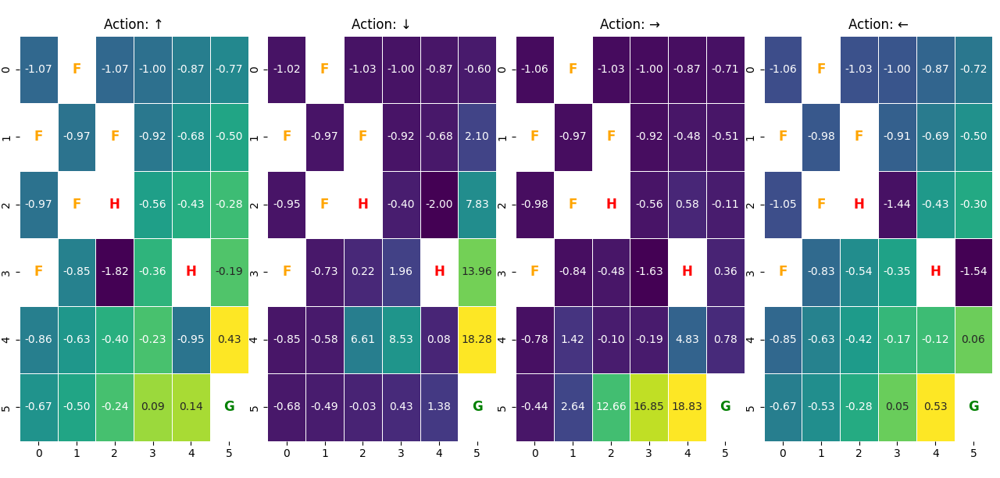

# Reinforcement Learning - JungleEscape & ContinuousMazeEnv

Two custom OpenAI Gymnasium environments with Q-learning and DQN agents
built in Python and PyTorch.

## Results

**Q-learning (JungleEscape)**
- Custom grid environment with reward shaping, life system, food and danger zones
- Stable convergence with γ=0.95, α=0.1 over 1,000 episodes

**Q-table Heatmap after 1000 episodes:**

**DQN (ContinuousMazeEnv)**
- Custom continuous maze environment
- 3-layer fully connected neural network (64→64→output)
- 100 consecutive successful episodes at ε=0.1 (Episodes 411–510)

## Hyperparameters

| Parameter | Q-learning | DQN |
|---|---|---|
| Discount factor (γ) | 0.95 | 0.99 |
| Learning rate (α) | 0.1 | 0.001 |
| Epsilon start | 1.0 | 1.0 |
| Epsilon min | 0.1 | 0.1 |
| Batch size | — | 32 |

## Structure
- `q-learning/` — JungleEscape environment and Q-learning agent
- `dqn/` — ContinuousMazeEnv and DQN neural network agent

## Technologies
Python · PyTorch · NumPy · OpenAI Gymnasium · Matplotlib · Seaborn
